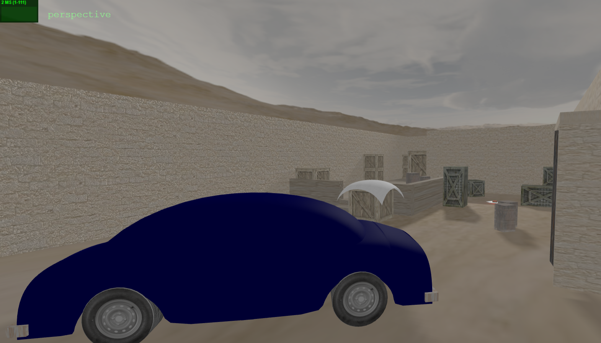

# SGI 2024/2025

## Group T05G07

| Name             | Number    | E-Mail             |
| ---------------- | --------- | ------------------ |
| João Pedro Rodrigues Coutinho         | 202108787 | up202108787@up.pt                |
| Miguel Jorge Medeiros Garrido         | 202108889 | up202108889@up.pt                |

----

## Projects

### [TP1 - Three.js Basics](tp1)

- One of the main strengths of our project is the use of several types of primitives, materials and textures, as well as the use of audio to make the scene feel more immersive.

- The scene, which possesses a set of different cameras, controllable on the graphical interface, contains the following objects:
  - Floor
  - Walls
  - Table
  - Plate
  - Cake without a slice
  - Candle with a flame
  - Spotlight
  - Two paintings with portraits
  - VW Beetle on a whiteboard
  - Coil Spring
  - Newspaper
  - Jar
  - Flower
  - Window/Landscape
  - Chair
  - Knife
  - Phonograph
  - Pens
  - Piece of Furniture
  - Carpet

- In addition to these objects, we also included some additional effects:
  - There are several randomized crumbs in the plate, due to the missing cake slice
  - Not only does the landscape have a panorama effect, but the window also simulates the effect of broken glass
  - There are multiple petals on the table, simulating a dead flower
  - The phonograph itself can be turned on and off, using the GUI, allowing it to play some music; there is a visual effect that indicates whether it is on or off
  - The chair has a broken leg, which is why it's lying on the floor

<div align="center">


</div>

-----

### [TP2 - YASF parser + de_dust2](tp2)

- The goal of this project was to develop a parser and create a Three.js scene based on the inputs of a YASF file.

- Our scene depicts our very own recreation of the classic ***de_dust2*** map from the original ***Counter-Strike*** - more specfically the *Bomb Site B* zone of the map.

- The scene utilizes all cameras, objects and features required in the practical work's specification (with the exception of the ```Triangle``` object, which is fully implemented but wasn't explicitly used).

<div align="center">


</div>

----

### [Balloon Racing](tp3)

- The goal of this project was to develop a small 3D game, consisting of a race on a user-controlled hot air balloon, following certain requirements.

<div align="center">


</div>
