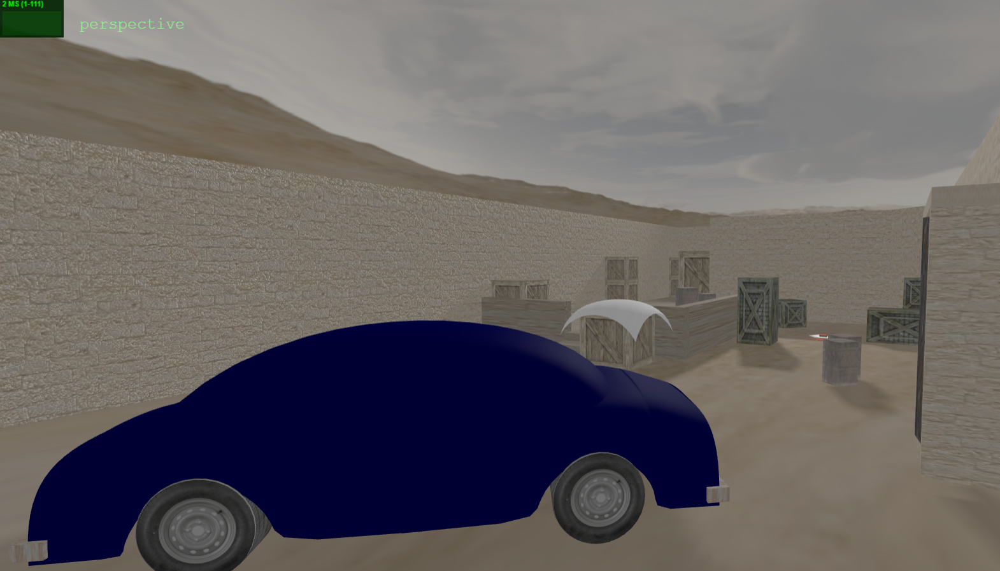

# SGI 2024/2025 - TP2 (***de_dust2***)

## Group T05G07

| Name             | Number    | E-Mail             |
| ---------------- | --------- | ------------------ |
| João Pedro Rodrigues Coutinho         | 202108787 | up202108787@up.pt                |
| Miguel Jorge Medeiros Garrido         | 202108889 | up202108889@up.pt                |

----
## Project Information

- The goal of this project was to develop a parser and create a Three.js scene based on the inputs of a YASF file.

- Our scene depicts our very own recreation of the classic ***de_dust2*** map from the original ***Counter-Strike*** - more specfically the *Bomb Site B* zone of the map.

- The scene utilizes all cameras, objects and features required in the practical work's specification (with the exception of the ```Triangle``` object, which is fully implemented but wasn't explicitly used).

<div align="center">


</div>

----
## Issues/Problems

- We had some issues recreating the borders of the map due to the scene's nature; for instance, the access tunnel from the *T spawn* to the site isn't displayed/rendered. 
- We had some trouble testing the implementation of the mipmap textures.
- We forgot to add the proper documentation to the code - hence why the submission was a few minutes late.
- Essentially, most of our problems during this project came down to not having enough time to further develop the scene, due to being one week behind schedule.