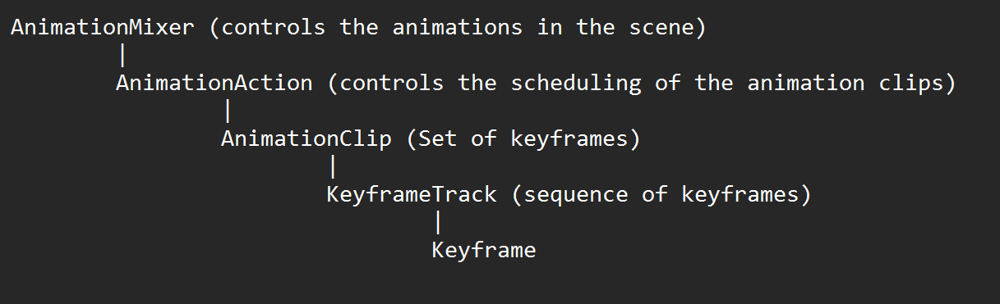
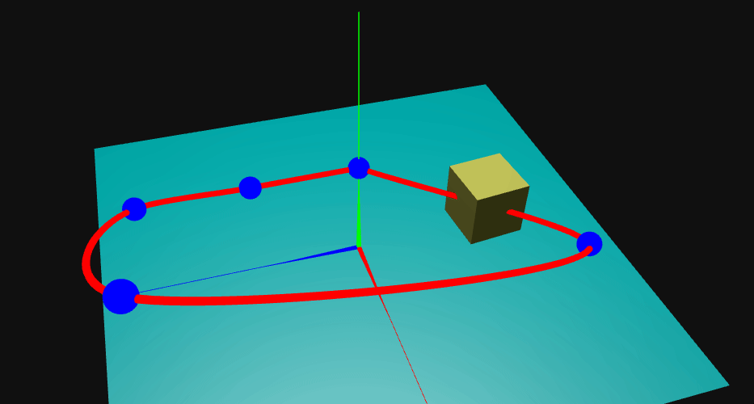
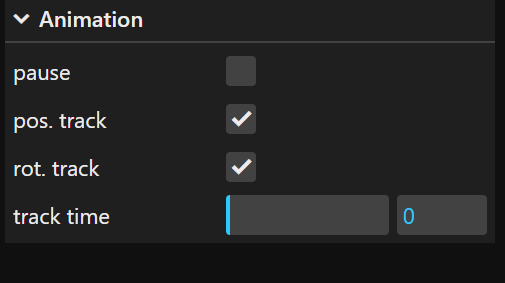

# Animation

Three.js has a rich animation system with multiple features suitable for specific use cases, e.g., skeleton animation and Keyframes. This sample will focus on animation by keyframes.

The following image presents the relation and dependencies between Three.js animation system.





Note: An animation clip can have multiple keyframe tracks, for example, the same AnimationClip, it is possible to animate the position, rotation, and change the color of an object




# Define an animation timeline

The following steps resume an animation by keyframes.

1. Define the keyframes

Define the propriety to be affected by the animation ('position'), set the time for the keyframe, and assign the positions to be achieved by the keyframe.

```js
const positionKF = new THREE.VectorKeyframeTrack('.position', [0, 1, 2, 3, 4, 5],
            [
                ...this.keyPoints[0],
                ...this.keyPoints[1],
                ...this.keyPoints[2],
                ...this.keyPoints[3],
                ...this.keyPoints[4],
                ...this.keyPoints[5]
            ],
            THREE.InterpolateSmooth  
        )
```

1. Assing to an AnimationMixer a specific object to be animated

```js
this.mixer = new THREE.AnimationMixer(this.boxMesh)
```


3. Create an AnimationClip, set a duration for the animation, and add the keyframes

```js
const positionClip = new THREE.AnimationClip('positionAnimation', 6, [positionKF])
```

4. Relate the Mixer and the animation clip
   
```js
const positionAction = this.mixer.clipAction(positionClip)
```       

5. Start the animation

```js
positionAction.play()
```


## UI/UX options

The UI/UX controls have some options to start/stop the animation, choose what animation track is enabled, and navigate through the timeline.



## References

[AnimationAction](https://threejs.org/docs/#api/en/animation/AnimationAction)

[AnimationClip](https://threejs.org/docs/#api/en/animation/AnimationClip)

[KeyframeTrack](https://threejs.org/docs/#api/en/animation/KeyframeTrack)

[AnimationMixer](https://threejs.org/docs/#api/en/animation/AnimationMixer)

[https://discoverthreejs.com/book/first-steps/animation-system](https://discoverthreejs.com/book/first-steps/animation-system)


